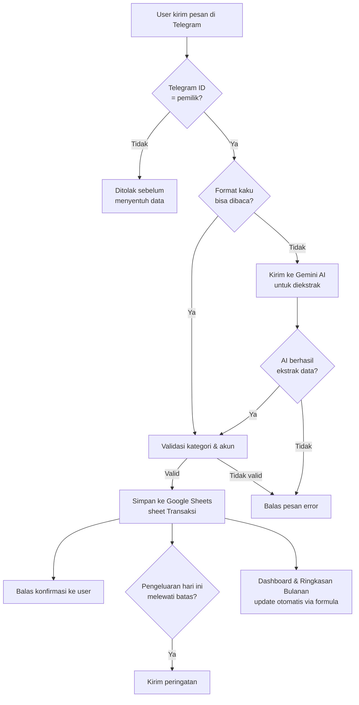

# 💰 UltraFinance — Bot Keuangan Pribadi

Personal finance tracker yang menggabungkan **Google Sheets** sebagai database, **Telegram Bot** sebagai antarmuka input, dan **Google Gemini AI** untuk memahami pesan transaksi dalam bahasa natural — dirancang supaya pencatatan keuangan harian bisa dilakukan dalam hitungan detik, langsung dari chat.

Dibangun dari nol sebagai proyek belajar coding, mulai dari spreadsheet manual sampai jadi sistem otomatis yang berjalan 24/7 di cloud.

---

## ✨ Fitur

- **Input transaksi via chat** — kirim pesan ke bot, otomatis tercatat ke Google Sheets
- **Dua mode parsing:**
  - Format cepat: `<kategori> <jumlah> <akun> <deskripsi>` — contoh: `makan 15000 bca beli nasi goreng`
  - Bahasa natural (AI fallback): `td abis makan siang di warung deket kantor 25rb pake bca`
- **Validasi otomatis** — AI tidak langsung dipercaya; hasil ekstraksinya tetap dicocokkan ke daftar kategori & akun asli di spreadsheet sebelum disimpan
- **Kategori & akun fleksibel** — ditambah langsung di Google Sheets, tidak perlu ubah kode
- **Deteksi tipe transaksi otomatis** — bot tahu sendiri apakah pesan itu pemasukan atau pengeluaran berdasarkan kategorinya
- **`/saldo`** — cek saldo seluruh akun (cash, bank, e-wallet) dan totalnya
- **`/ringkasan`** — rekap pemasukan, pengeluaran, dan breakdown per kategori **bulan berjalan**
- **`/ringkasanbulanan`** — rekap **bulan apa saja**: bot bertanya "mau bulan apa?", jawabannya boleh bebas (`agustus`, `bulan lalu`, `2 bulan lalu`, `08/2026`)
- **`/hariini`** — daftar transaksi hari ini beserta total masuk/keluar
- **Peringatan batas harian** — setiap pengeluaran yang membuat total hari itu melewati batas (default Rp50.000), bot langsung mengirim notifikasi; transfer antar akun (Tarik Tunai, Top Up) tidak dihitung
- **Permintaan dalam bahasa natural** — selain mencatat transaksi, ketik bebas seperti `ringkasan agustus` atau `pengeluaran bulan lalu gimana?`; dipahami lewat kata kunci dulu, AI sebagai cadangan
- **Khusus pemilik** — bot hanya melayani satu Telegram ID, semua orang lain ditolak sebelum menyentuh data
- **Dashboard spreadsheet** — ringkasan visual, grafik tren pengeluaran, dan tracking net worth di Google Sheets
- **Timezone-aware** — semua perhitungan tanggal dikunci ke WIB (Asia/Jakarta), tidak terpengaruh zona waktu server

## 🧱 Tech Stack

| Komponen | Teknologi |
|---|---|
| Bahasa | Python 3.13 |
| Bot framework | [python-telegram-bot](https://github.com/python-telegram-bot/python-telegram-bot) |
| Database | Google Sheets (via [gspread](https://github.com/burnash/gspread)) |
| AI parsing | Google Gemini API (free tier) |
| Autentikasi Google | Service Account (OAuth2) |
| Hosting | [Railway](https://railway.app) (24/7, auto-deploy dari GitHub) |
| Config | Environment variables (`python-dotenv` untuk lokal) |

## 🏗️ Arsitektur

Prinsip desain: **format kaku selalu dicoba lebih dulu** (instan, gratis, tanpa panggil API eksternal) — AI hanya dipakai sebagai fallback saat parsing sederhana gagal, untuk menghemat kuota dan menjaga bot tetap responsif.

## 📂 Struktur Google Sheets

| Sheet | Fungsi |
|---|---|
| Dashboard | Ringkasan, grafik tren, net worth, progress goals |
| Kategori | Master kategori pengeluaran & sumber pemasukan (bisa ditambah bebas) |
| Akun | Daftar rekening/dompet + saldo berjalan otomatis |
| Transaksi | Log seluruh transaksi (sumber data utama bot) |
| Ringkasan Bulanan | Rekap otomatis per bulan via `SUMIFS` |
| Investasi | Nilai awal, sekarang, gain/loss, alokasi portofolio |
| Aset & Net Worth | Total aset-liabilitas, tren net worth bulanan |
| Financial Goals | Target keuangan dan progress-nya |

## 🚀 Menjalankan Sendiri

1. Clone repo ini
2. `pip install -r requirements.txt`
3. Salin `.env.example` jadi `.env`, isi dengan:
   - `TELEGRAM_TOKEN` — dari [@BotFather](https://t.me/BotFather)
   - `SHEET_ID` — ID Google Sheets kamu
   - `GOOGLE_CREDENTIALS_JSON` — kredensial Service Account (Google Cloud Console)
   - `ALLOWED_USER_ID` — Telegram ID pemilik bot (jalankan bot dulu, kirim `/id` untuk melihat ID kamu). Selama kosong, bot menolak semua orang.
   - `GEMINI_API_KEY` — dari [Google AI Studio](https://aistudio.google.com/app/apikey) (opsional, tanpa ini bot tetap jalan pakai format kaku saja)
   - `BATAS_HARIAN` — batas pengeluaran harian dalam Rupiah (opsional, default 50000)
4. `python bot.py`

Untuk deploy 24/7, project ini sudah siap pakai [Railway](https://railway.app) — tinggal hubungkan repo dan isi environment variables yang sama.

## 🐛 Tantangan & Pembelajaran

Beberapa isu nyata yang ditemukan dan diperbaiki selama development — disimpan di sini sebagai catatan proses, bukan cuma hasil akhir:

- **Timezone bug** — server hosting berjalan di UTC, menyebabkan fitur `/hariini` salah hari selama dini hari WIB. Diperbaiki dengan mengunci semua logika tanggal ke `Asia/Jakarta` secara eksplisit lewat `zoneinfo`.
- **Parsing kategori multi-kata** — kategori seperti "Belanja Kebutuhan" awalnya salah dibaca karena parser hanya mengambil kata pertama. Diperbaiki dengan pencocokan kategori terpanjang lebih dulu.
- **Model AI deprecated** — Google menghentikan dukungan model Gemini yang awalnya dipakai untuk akun baru pertengahan proses development; diselesaikan dengan menambah logging eksplisit ke production logs supaya error API tidak "tertelan diam-diam", mempercepat diagnosis.
- **Ringkasan bulan lampau hilang** — sheet "Ringkasan Bulanan" memakai jendela 12 bulan yang dimulai dari `TODAY()`, sehingga bulan yang sudah lewat otomatis hilang dari rekap. Solusinya: bot menghitung ringkasan langsung dari log Transaksi (satu panggilan API), jadi bulan mana pun bisa ditampilkan.
- **Deployment conflict** — menjalankan bot di lokal dan di server cloud secara bersamaan dengan token yang sama menyebabkan Telegram menolak koneksi; dipahami sebagai konsekuensi dari `long polling` yang hanya mengizinkan satu instance aktif per bot.

## 🔒 Keamanan

- Semua kredensial (token bot, service account, API key) disimpan sebagai environment variables, tidak pernah masuk ke kode atau repository
- `.gitignore` mengecualikan `.env` dan `credentials.json` dari version control
- Bot hanya melayani satu Telegram ID (`ALLOWED_USER_ID`); pengecekan dilakukan di gerbang paling awal sehingga orang lain tidak pernah sampai ke handler atau data. Kalau variable belum diisi, bot menolak semua orang (aman secara default)
- Hasil ekstraksi AI tidak pernah langsung dipercaya — selalu divalidasi ulang ke data sumber sebelum disimpan

## 🗺️ Kemungkinan Pengembangan Selanjutnya

- Command untuk koreksi/hapus transaksi terakhir
- Reminder harian otomatis (notifikasi proaktif, bukan hanya saat mencatat transaksi)
- Tracking progress financial goals via bot
- Dukungan multi-user (satu bot untuk banyak pengguna dengan sheet masing-masing)

---

*Dibangun sebagai proyek belajar — dari spreadsheet manual, Python dasar, deployment cloud, sampai integrasi AI, dikerjakan dari nol tanpa latar belakang coding sebelumnya.*
